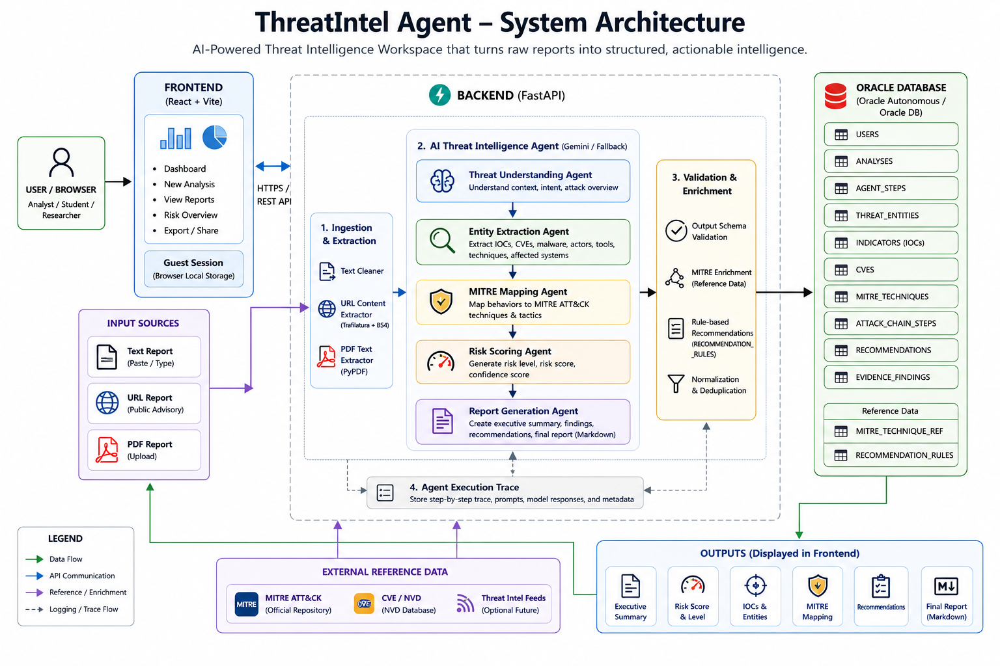

# ThreatIntel Agent

**ThreatIntel Agent** is an AI-powered cyber threat intelligence workspace that converts threat reports into structured analyst-ready intelligence briefs.

It supports **Text**, **URL**, and **PDF** input, then generates threat summaries, IOCs, CVEs, MITRE ATT&CK mapping, risk scoring, evidence-backed findings, recommendations, and final Markdown reports.

> This is a research and portfolio project for defensive security analysis. AI-generated findings may be incomplete and should be reviewed before real-world security use.

---

## Developed By

**Utsav Dharani**

---

## Architecture Diagram

---

## Brief Overview

ThreatIntel Agent is designed to demonstrate how AI agents can support cyber threat intelligence workflows.

The application accepts a cyber threat report from the user, extracts readable content, sends it through an AI-powered backend workflow, validates the structured output, enriches results with MITRE ATT&CK reference data and rule-based recommendations, stores the report in Oracle Database, and displays the final intelligence brief in a React dashboard.

The project is built as a full-stack portfolio system with a strong focus on backend AI agent orchestration, structured data storage, and practical defensive security use cases.

---

## Key Features

### Input Support

- Text threat report analysis
- Public cybersecurity advisory URL analysis
- PDF threat report upload
- Built-in sample inputs for quick testing

### AI Threat Intelligence Output

- Executive summary
- Threat entities
- Indicators of compromise
- CVE extraction
- MITRE ATT&CK mapping
- Attack chain reconstruction
- Risk level and risk score
- Confidence score
- Evidence-backed findings
- Analyst recommendations
- Final Markdown-formatted intelligence brief

### Dashboard Features

- Guest browser session history
- Recent intelligence briefs
- Risk distribution summary
- Report quality scoring
- Fixed-size scrollable tables
- Markdown export
- Email summary sharing
- Modern dashboard UI
- Collapsible sidebar

---

## Report Quality Framework

ThreatIntel Agent includes a report quality scoring framework based on:

- Completeness
- Evidence grounding
- Cyber relevance
- Actionability
- Readability

This is not a verified accuracy percentage. It is a quality signal that helps users understand how complete and useful the generated report is.

---

## Tech Stack

### Frontend

- React JS
- Vite
- Tailwind CSS
- React Markdown
- Remark GFM

### Backend

- Python
- FastAPI
- Uvicorn
- Pydantic
- python-oracledb
- BeautifulSoup
- Trafilatura
- PyPDF

### Database

- Oracle Database
- Oracle SQL tables for users, analyses, agent steps, indicators, CVEs, MITRE mappings, recommendations, and evidence findings

### AI

- Gemini API integration
- Mock/fallback mode support for development

---
